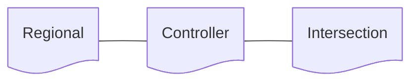

# Configurations
Running a signal program depends on certain configurations defined outside of the signal progam.

Configurations are organized in a hierachy from general to specific.

## Regional
Configurations which are typically the same for all controllers in a region, often due to natioanl/regional regulation.

- default red-yellow time

## Controller
Configuration of a particular controller.
A controller manages one or more physical/logical intersections.

 - List of intesections

## Intersection
Configurations for a particular physical/logical intersection.

- List of signal groups

