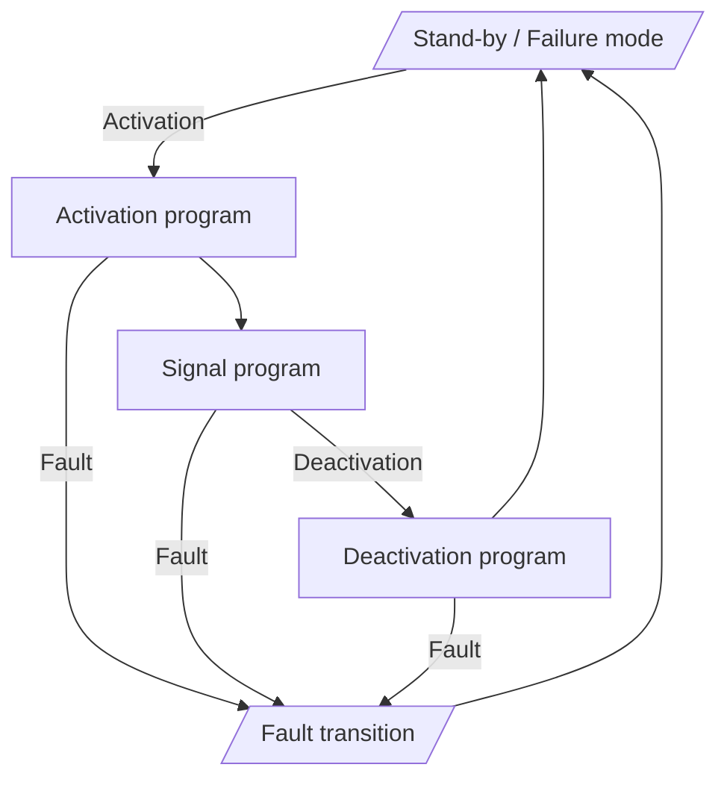
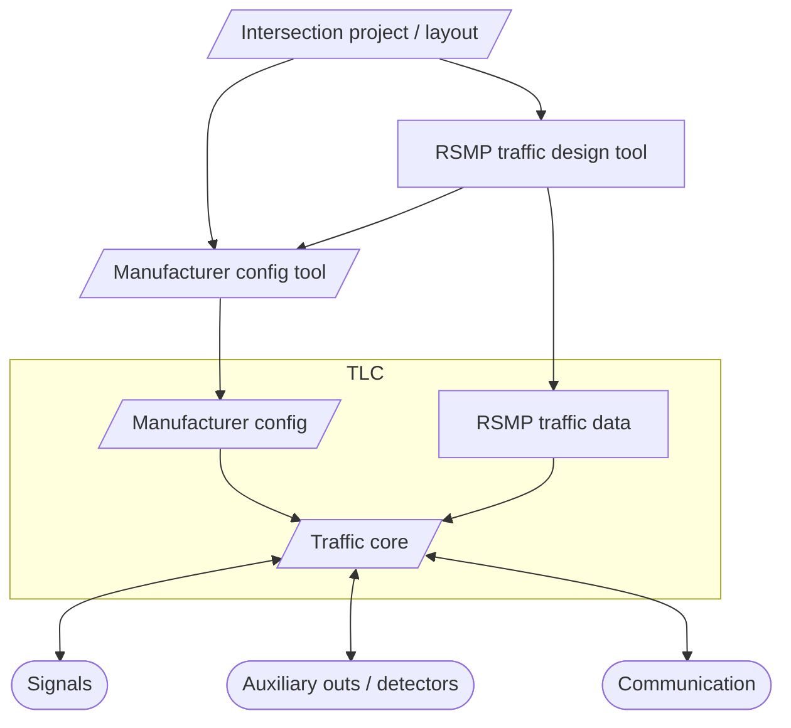

# RSMP TLC programming

The goal of the RSMP TLC programming is to crate a common data structure containing traffic programming parameters and 
describe the way these parameters should be interpreted in a TLC. 
The data structure should provide enough information to produce identical traffic behaviour of any TLC executing it,
given the same detector and communication input. 

It is not intended to define any safety related parameters, fault management and fault nor transitions. The TLC internal 
safety mechanisms must be active at all times and take over at any time a safety 
relevant fault occurs. Similarly, should the parameters lead to any unsafe, undefined or disallowed signals, 
TLC must take over the control and ensure that the safety requirements are not compromised. 

## Controlling modes

A controlling mode defines the way the signal groups are controlled and what constrains are applied. The controller is
always in one of the controlling modes. 

Stand-by / Failure mode
: This mode usually corresponds to flashing yellow light on defined signal groups. Exact requirements are defined by the 
legislation and can be different in different countries. This mode can be subdivided to other modes. 
In case of need or a fatal failure this can also correspond to a Dark mode - all light off. No green signal is allowed
during this mode.

Activation program
: A specific fixed time program intended to transition from the Stand-by mode to the Signal program. 
In its starting point all signal groups begin in the signal corresponding to the Stand-by mode. 
It defines all the necessary intermediate transitions until the time point where the control can be switched to a 
specific signal program.

Signal program
: Normal controlling mode in which an algorithm is controlling individual signal groups based on the parameters, 
detector inputs and other inputs and commands.

Deactivation program 
: A specific fixed time program intended to transition from a specific point in the program to a stand-by mode.

Fault transition
: Emergency mode that is controlled by the internal systems of the TLC which is used in case of a fault. 
In this case the TLC is brought either to Dark or stand-by mode according to the local regulation. 
Minimum green times or regular signal sequences do not have to be kept.

## Traffic design workflow

Following chapter describes the intended workflow.

Intersection project / layout
: A set of project files, maps, requirements description and other documents that provide information about the intersection. 

RSMP traffic design tool
: A graphical application capable of designing the controlling program within the capabilities of RSMP TLC and its transport format. This can be a part of bigger set of traffic-related package or a stand-alone application.

Manufacturer config tool
: TLC specific graphical application used to configure low-level and non-traffic related parameters, diagnose the 
TLC and access specific features.

Manufacturer config
: Any manufacturer specific data supplied into the TLC outside of the scope of this project.

Traffic core
: Internal programming of the TLC that controls the signals interpreting the configuration data, detector inputs and communication.

