# Fixed Time Program
A fixed time program is a basic form of control strategy which define a fixed cycle length and a fixed schedule of when signal grooups change.

All cycles are exactly the same, and there is no use of detectors. The controller is essentially playing back a predefines program.

## Prerequisites
Running a fixed time program depends on separate intersection, controller and region configurations.

Specifiically, signal groups and the conflict matrix are defines in the intersection configurarion, not in the signal program.

Similary, regional settings like red-yellow time is defined in the regional/controller/intersection configuration, not in the signal program.

## Structure
A fixed time program defines a cycle length, and has a number of commands at specific times.

Each command lists the signal groups it affects.

For example, consider a simple four-legged interesction with A and B directions. The intersction has four singal groups: a1, a2, b1 and b2.

A simnple fixed time program for this intersection mighth have a cycle length of 60s, with the A direction being green for the first 30s, and the B direction being green
for the last 30s.

```mermaid
---
displayMode: compact
---
gantt
    title Fixed Time Program
    dateFormat ss
    axisFormat %S
    todayMarker off
    section a1
        green :green, 00, 30s
    section a2
        green :green, 00, 30s
    section b1
        green :green, 30, 30s
    section b2
        green :green, 30, 30s
```





This RSMP fixed time program for this is:

```yaml
length: 60
commands:
  0: { "start": ["a1","a2"], "stop": ["b1", "b2"] }
  30: { "stop": ["a1","a2"], "start": ["b1", "b2"] }
```




```mermaid
gantt
    title Fixed Time Program
    dateFormat ss
    section a1
        Green           :a1, 00, 30s
    section b1
        Green           :b1, 30, 30s
```

`length` defines the cycle length in seconds, in this case 60s. When this time is reached, the program starts over.

`commands` is a hash of commands. The key indicating the time in seconds, while the value is a hash of commands:
- At 0s in the cycle the A direction (groups a1 and a2 ) is started, while the B direction (groups b1 and b2) is stopped.
- At 30s in the cycle the A direction (groups a1 and a2) is stopped, while the B direction (groups b1 and b2) is started.

When a groups is request to start/stop, the controller is responsible for first going to yellow when needed,
according to relevant configurations of red-yellow times, safety times, etc. The behaviour also depend on the type
of signal group. For example a pedestrian signal will often changes directly from red to green.

Smart commands are very convenient and the program definition is very concise, but you don't have the option
to custome each change, since they are handled automatically by the controller.

## Commands
### Smart Commands
With smart commands, you request the controller to reach a specific state, and it determines how, e.g. by first going to yellow.

- `start`: Requests that groups start. Depending on the type of a signal group, this could mean green, flashing., etc.
- `stop`: Requets that groups stop. Depending on the type of signal group, this could mean red, dark, etc.

### Manual Commands
Manual commands are used to force a particular state immediately, making it possible to customize things like yellow times.

You are responsible for making sure the appropriate safety times, etc. are respected. If not, a fault will occur when you run the program.

- `green`
- `red`
- `red-yellow`

The fixed time program above could be defines with manual commands as:

```yaml
length 60:
commands:
  0: { "red-yellow": ["a1", "a2"], ""red": ["b1", "b2"] }
  3: { "green": ["a1", "a2"] }
  30: { "red": ["a1", "a2"], "red-yellow": ["b1", "b2"] }
  33: { "green": ["b1", "b2"] }
```

Manual commands gives you full ability to customize every change, but you're responsible for taking into acocunt safety times, etc.
and program definitions are not quite as concise as when using smart commands.

