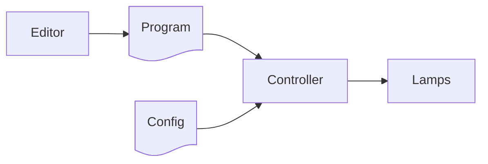

# Overview
An RSMP TLC Program is a standardized way to describe a signal program for a traffic light controller.

Programs can be created with any suitable editor, and then deployed to the controller.

To run a a program, other [configurations](configurations.md) must be present on the controller. including:
- regional configurations, e.g. red-yellow times.
- controller configurations, e.g. list of intersections.
- intersection configurations, e.g. signal groups and their conflict matrix.

When the controller runs the program it will change lamps and/or other hardware over time, e.g. change 
between red, yellow and green. Flashing yellow, dark, sound signals, etc. are also possible, depending
on the signal group type.

The internal safety mechanisms of the controller must be active at all times and take over at any time a safety
relevant fault occurs. Similarly, should the parameters lead to any unsafe, undefined or disallowed signals,
the controller must take over and ensure that safety is not compromised.

## Format
Program are stored as YAML files, but can be transmitted as eg. JSON or CBOR.

## Control Strategies
The first control strategy supported is [fixed-time](fixed_time.md).

Additional control strategies will be added later.

