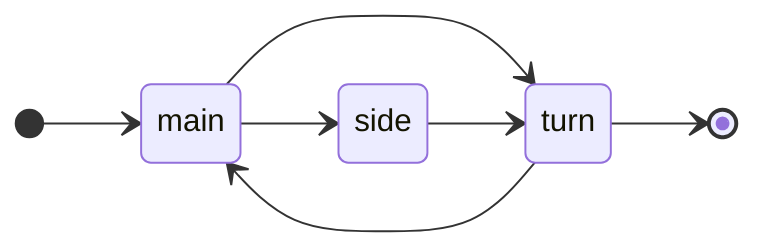

# Stage-based Strategy
A stage-based program consists of stages separated by transitions. All state changes occur during transitions, while state remain static during stages.

## Prerequisites
Running a stage-based program depends on regional, controller, and intersection [configurations](configurations.md), which are defined outside the signal program.

Specifically, signal groups and the conflict matrix are defined in the intersection configuration, not in the signal program.

Similarly, regional settings like red-yellow time are defined in the regional/controller/intersection configuration, not in the signal program.

Controllers must use UTC [synchronized](synchronization.md) using NTP.

## Structure
Stage-based programs first define stages and transitions.
Program are then defines by which stages are used, the flow between stages and where you enter and leave the program.

The stage names "enter" and "leave" are reserved and cannot be used when defining stages.

```yaml
groups: ["a1", "a2", "b1", "b2", "a1_l"]
stages:
  main:
    open: ["a1", "a2"]
    duration: { default: 20, max: 29 }
  side:
    open: ["b1", "b2"]
    duration: { min: 10, default: 20, max: 26 }
  turn:
    open: ["a1_l"]
    duration: { default: 10 }
  oneway:
    open: ["a1"]
transitions:
  main:
    side:
      default:  ["11000", 3, "00220", 2]
      quick:    ["11000", 5, "00220", 4]
    turn:       ["11002", 3]
  side:
    turn:
      default:  ["11000", 5]
      quick:    ["11000", 3]
  turn:
    main:       ["11000", 3]
programs:
  quiet:
    enter: {main:}
    main:  {side:, turn:}
    side:  {turn:}
    turn:  {main:, leave:}
  busy:
    enter: {side:}
    side:  {main: quick}
    main:  {side: quick, leave: quick}
  event:
    enter: {side:}
    side:  {turn:, :leave}
    turn:  {side:}
```

The `quiet` program going through the stages main-side-turn can be visualized as a timeline:

```
stage  |main              |      |side             |   |turn    |   |
a1     |AAAAAAAAAAAAAAAAAA|111   |                 |   |        |   |
a2     |AAAAAAAAAAAAAAAAAA|111   |                 |   |        |   |
b1     |                  |   222|AAAAAAAAAAAAAAAAA|111|        |   |
b2     |                  |   222|AAAAAAAAAAAAAAAAA|111|        |   |
a1_l   |                  |      |                 |   |AAAAAAAA|111|
switch |*                 |      |                 |   |        |   |
       0s                                                           60s
```

Or as a stage diagram:



## Stages
Each stage is defined by which groups are open and for how long. All other groups must be closed.
Open typically means green, while closed typically means red. But depending on the type of group it could be e.g. a white horizontal or vertical bar for public transport.

All groups remain in the same state throughout the stage. All state changes happen during transitions.

You can define how much the stage can be shortened or extended by setting `min` and/or `max` durations.

Example:

```yaml
stages:
  main:                                # stage name
    open: ["a1", "a2"]                 # list of groups
    duration: { default: 20, max: 29 } # duration settings
```
- `open`: List of signal groups that are open (typically green).
- `duration`: Durations in seconds. `default` is required, while `min` and `max` are optional and specify possible shortening and extension.

## Transitions
A transition defines how to move from one stage to another by explicitly listing all state changes, including intermediate states like yellow.

A transition does not include the start and end states, as these are defined by the stages you come from and go to.

A  transition always goes through the same state changes with the same duration.

If a transition between stages A and B is not defined, the program cannot transition directly from A to B, although it might be possible to reach B via other stages.

When designing a stage-based program, it must be ensured that all transitions are valid.

You can define a single transition between two stages, by setting the value of the <to stage> to a sequence:

```yaml
  <from stage>:
    <to stage>: [<transition sequence>]
```

Example:

```yaml
  main:
    side: ["11000", 3, "00220", 2]
```

Or you can define multiple transitions between the two stage by using a map:

```yaml
  <from stage>:
    <to stage>:
      <transition name>: [<transition sequence>]
      <transition name>: [<transition sequence>]
```

Example:

```yaml
  main:
    side:
      default:  ["11000", 3, "00220", 2]
      busy:     ["11000", 5, "00220", 4]
```

The transition name `default` is special. If you define multiple transitions between two stages and refer to a transition bewtween within using a transition name, the `default` transition must be defined and will then be used.

Transition sequences are defined as an array with an even number of elements. It starts with a state string followed by a duration, and then repeat these pairs. It can have 0, 1 or more state/duration pairs. Each character refers to a group listed in `groups` defined earlier.

## Programs
A program is defined by which stages and transitions be be used.
It's defined as a map of source/transtions, with transitions  listed using an array of strings, e.g:

```yaml
programs:
  <program name>:
    <from stage>:
      <to stage>: <optional transtion name>
```
The stage names `enter` and `leave` are special, and used to indicate where you can enter or leave the program, i.e. switch between programs.

Example:
```yaml
programs:
  quiet:
    enter: {main:}
    main:  {side:, turn:}
    side:  {turn:}
    turn:  {main:, leave:}
```

Here the the controller can enter the program at the main stage. From the main stage it can go to either the side or the turn stage.
From side it can go only to side, and from turn it can go only to main. It can leave from the side stage.

In case different transitions are defined for the same source/destination stage pair a variant can specified. If not specied,
the default transition will be used:

```yaml
  busy:
    side:
      main: quick     # when going from side to main, use the quick transition.
```

Note: No logic is yet defined for how to choose which transition to use. This will be expanded later.

## Switching Programs
A program switch can occur at stages that are marked for either entering or leaving, usign the special stage names `enter` and `leave`:

```yaml
    enter:
      main:
    main:
      leave:
```
### Direct switch
If program A allows leaving from the `main` stage, and program B allows entering into the same `main` stage, then a switch from A to B can happend directy as soon as the main stage is reached.

### Transition switch
If program A allows leaving from the `main` stage, but program B allows entering only to a different stage like `side`, then a transition from the `main` stage to the `side` stage must be defined for a switch to be possible. If more than one transition between the two stages are defined you can specify which one is used:

```yaml
    enter:
      main:
    main:
      leave: quick
```

## Switching between program with different control strategies
It's allowed to switch between programs using different control strategies. But whether you switch to a program with the same or different control strategy, the two programs must have compatible signal states at the switch point. 
For stage-based program the switch points are the stages are maked for entering/leaving. The states is defined by the stages themselves, i.e. which grous are open/closed.

```yaml
groups: ["a1", "a2", "b1", "b2", "a1_l"]
stages:
  main:
    open: ["a1", "a2"]

For example, the main stage has groups a1 and a2 open, and all other groups closed, corresponding to the state "11000". You can switch to/from another type of program, e.g. a fixed time program, if it defines a switch points with the same state.

## Changing Offset
Intersections that use the same cycle length can be coordinated by modifying their offsets. But a change in offset can happen for other reasons, e.g.:

- manual change of the offset
- change between signal programs
- synchronization of the underlying UTC time
- leap seconds

However, the offset cannot be changed abruptly, as this might cause invalid state changes or might violate constraints like minimum or intergreen times.

Instead the offset must be moved gradually by shortening or extending stages. Since all groups remain in the same state during a stage, this is guaranteed to never cause invalid state changes.

Once the target offset is reached, cycle time must be kept constant, to ensure coordination is kept.

### Extending and Shortening Stages
Shortening stages will move the offset forward, while extending stages will move it backward.

Since the program is cyclic, reaching the target offset can be achieved either by shortening or extending stages. The quickest way should be chosen.

Only stages with `min` defined can be shortened and only stages with `max` defined can be extended.

Stages with neither `min` nor `max` are fixed in duration. If no stage defines a `min` or `max` the offset cannot be moved and the controller cannot be coordinated with other controllers.

When trying to reach the target offset, shortening/extending is done one stage at a time, while respecting min/max durations. Reaching the target offset might take more than one cycle, depending on the min/max values defined and the target offset.

Once the target offset is reached, the controller must adjust stage durations to ensure that the actual cycle time matches the cycle time defined in the program, taking into account the transition durations.

A program is invalid if the stages cannot be extended/shortened so that the actual cycle time matches the cycle time defined for the program.

## Faults
The controller must respect all safety constraints (minimum green, intergreen, etc.). Invalid configurations or unsafe transitions result in a fault.
Programs should be validated using a simulator or test tool before deployment.

